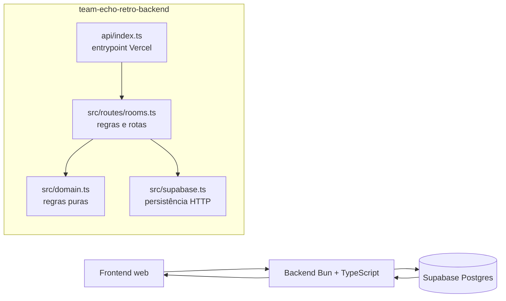
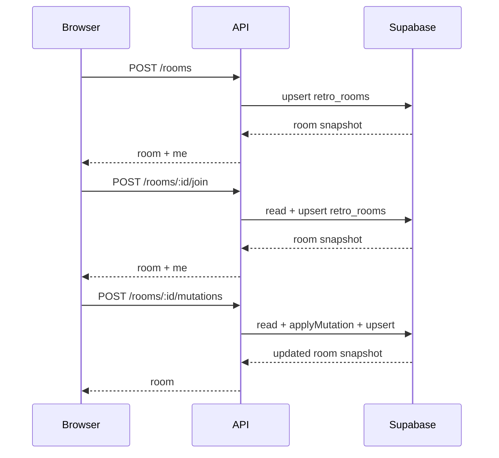
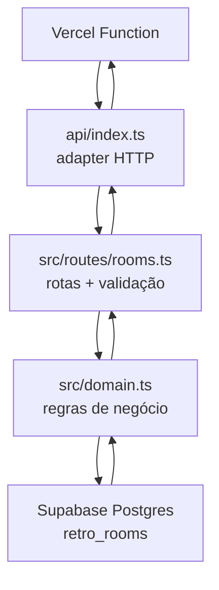

# Team Echo Retro Backend

API HTTP em Bun + TypeScript que mantém o estado canônico das salas de retrospectiva no Supabase.

Este repositório é o backend do sistema. O frontend vive em `team-echo-retro` e conversa com esta API via `fetch`.

## O que este backend faz

- Cria salas.
- Adiciona participantes ao entrar por link.
- Lê o snapshot atual da sala.
- Aplica mutações de cards, colunas e cronômetro.
- Persiste o snapshot completo da sala no Supabase.

## Como o sistema se organiza



### Responsabilidades do backend

- Validar payloads com `zod`.
- Garantir permissões de líder e participante.
- Normalizar timer e estado da sala.
- Persistir e ler a sala em `retro_rooms`.
- Responder com `JSON` e cabeçalhos de CORS.

### O que não fica no backend

- Estado visual da interface.
- Tokens de login, porque não existe autenticação de usuário.
- Websocket, porque o sistema usa polling simples.
- Qualquer segredo do Supabase no frontend.

## Regras de negócio

- Toda sala tem um líder, definido na criação.
- O líder pode adicionar, remover, renomear e reordenar colunas.
- O líder também controla o cronômetro e pode finalizar a retro.
- Qualquer participante presente na sala pode adicionar cards.
- Um participante só pode editar ou remover os próprios cards.
- O cronômetro termina em `ended` quando o tempo chega a zero.
- Depois que a retro é finalizada, novas mutações são bloqueadas.
- O `join` atualiza o nome do participante se ele já existir na sala.

## Fluxo de request



## Como rodar localmente

### Pré-requisitos

- Bun
- Um projeto Supabase com a tabela `retro_rooms`

### Instalação

```bash
bun install
```

### Variáveis de ambiente

Crie um `.env` na raiz deste projeto:

```bash
SUPABASE_URL=https://your-project.supabase.co
SUPABASE_SERVICE_ROLE_KEY=your-service-role-key
PORT=8787
```

### Subir localmente

```bash
bun run dev
```

O backend sobe em `http://localhost:8787`.

## API

### `GET /health`

Retorna:

```json
{ "ok": true }
```

### `POST /rooms`

Cria uma sala nova.

Payload:

```json
{
  "roomName": "Sprint 24",
  "leaderName": "Lucas",
  "leaderId": "abc123",
  "duration": 900
}
```

### `GET /rooms/:roomId`

Retorna o snapshot atual da sala.

### `POST /rooms/:roomId/join`

Adiciona ou atualiza um participante.

Payload:

```json
{
  "name": "Maria",
  "participantId": "p1"
}
```

### `POST /rooms/:roomId/mutations`

Aplica uma mutação de domínio na sala.

Payload:

```json
{
  "participantId": "p1",
  "mutation": {
    "type": "addCard",
    "columnId": "c1",
    "text": "Melhoramos o fluxo de deploy"
  }
}
```

## Modelo de dados

### Tabela `retro_rooms`

```sql
create table if not exists public.retro_rooms (
  id text primary key,
  state jsonb not null,
  created_at timestamptz not null default now()
);
```

### Estrutura do snapshot

- `id`
- `name`
- `leaderId`
- `participants`
- `columns`
- `cards`
- `timer`
- `finished`

## Arquitetura do backend



### Como o código se separa

- `api/` contém o entrypoint usado pela Vercel.
- `src/` contém a implementação do domínio e da persistência.
- `supabase/migrations/` contém o schema do banco.

### Regras de implementação

- `api/index.ts` trata CORS, healthcheck e encaminhamento.
- `src/routes/rooms.ts` valida requests e chama o domínio.
- `src/domain.ts` aplica as regras puras da retro.
- `src/supabase.ts` faz leitura e escrita no Supabase usando a service role key.

## Deploy na Vercel

1. Crie um projeto na Vercel apontando para este repositório.
2. Configure as variáveis de ambiente:
   - `SUPABASE_URL`
   - `SUPABASE_SERVICE_ROLE_KEY`
3. Use `api/index.ts` como função de entrada.
4. Aponte o frontend para a URL pública da API usando `VITE_BACKEND_URL`.

## Notas operacionais

- O backend não expõe a service role key no frontend.
- O frontend faz polling da API para sincronizar sala entre abas e dispositivos.
- O estado persistido é sempre o snapshot completo da sala.
- O sistema foi mantido sem websocket para evitar complexidade desnecessária.
